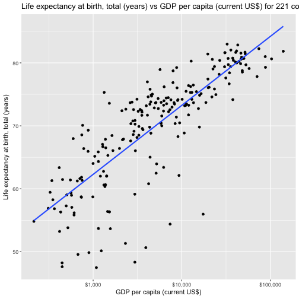

Loading the required libraries

```r
library(tidyverse)
library(car)
library(GGally)
library(ggplot2)
```

Displaying the summary tables:

```r
region_summary = read_csv('results/summary_tables/region_summary.csv')
```

```
## Warning: Missing column names filled in: 'X1' [1]
```

```
## Parsed with column specification:
## cols(
##   X1 = col_integer(),
##   Region = col_character(),
##   Count = col_integer()
## )
```

```r
(region_summary)
```

```
## # A tibble: 8 x 3
##      X1                     Region Count
##   <int>                      <chr> <int>
## 1     0      Europe & Central Asia    57
## 2     1         Sub-Saharan Africa    48
## 3     2  Latin America & Caribbean    41
## 4     3        East Asia & Pacific    36
## 5     4                       <NA>    33
## 6     5 Middle East & North Africa    21
## 7     6                 South Asia     8
## 8     7              North America     3
```
This is a summary of all regions for whom we have data in the given dataset.


```r
source_of_most_recent_income_and_expenditure = read_csv('results/summary_tables/source_of_most_recent_income_and_expenditure.csv')
```

```
## Warning: Missing column names filled in: 'X1' [1]
```

```
## Parsed with column specification:
## cols(
##   X1 = col_integer(),
##   CountryCode = col_character(),
##   LatestPopulationCensus = col_character(),
##   SourceOfMostRecentIncomeAndExpenditureData = col_character(),
##   ShortName = col_character()
## )
```

```r
head(source_of_most_recent_income_and_expenditure,'20')
```

```
## # A tibble: 20 x 5
##       X1 CountryCode
##    <int>       <chr>
##  1     0         AFG
##  2     1         ALB
##  3     2         DZA
##  4     3         ASM
##  5     4         ADO
##  6     5         AGO
##  7     6         ATG
##  8     7         ARB
##  9     8         ARG
## 10     9         ARM
## 11    10         ABW
## 12    11         AUS
## 13    12         AUT
## 14    13         AZE
## 15    14         BHR
## 16    15         BGD
## 17    16         BRB
## 18    17         BLR
## 19    18         BEL
## 20    19         BLZ
## # ... with 3 more variables: LatestPopulationCensus <chr>,
## #   SourceOfMostRecentIncomeAndExpenditureData <chr>, ShortName <chr>
```
These are the top 20 rows of the summary of the source of most recent income and expenditure data for different countries.


```r
distinct_indicator_names_and_codes  = read_csv('results/summary_tables/distinct_indicator_names_and_codes.csv')
```

```
## Warning: Missing column names filled in: 'X1' [1]
```

```
## Parsed with column specification:
## cols(
##   X1 = col_integer(),
##   SeriesCode = col_character(),
##   IndicatorName = col_character()
## )
```

```r
head(distinct_indicator_names_and_codes,'20')
```

```
## # A tibble: 1,345 x 3
##       X1           SeriesCode
##    <int>                <chr>
##  1     0       BN.KLT.DINV.CD
##  2     1 BX.KLT.DINV.WD.GD.ZS
##  3     2    BX.KLT.DINV.CD.WD
##  4     3    BM.KLT.DINV.GD.ZS
##  5     4       BN.TRF.KOGT.CD
##  6     5       BN.KAC.EOMS.CD
##  7     6       BN.FIN.TOTL.CD
##  8     7    BX.PEF.TOTL.CD.WD
##  9     8       BN.KLT.PTXL.CD
## 10     9    BX.KLT.DREM.CD.DT
## # ... with 1,335 more rows, and 1 more variables: IndicatorName <chr>
```
These are the top 20 rows of the summary of the distinct Indicators Names and codes found in the indicator dataset

# Hypothesis 1 

Ho(Null Hypothesis): There is NO effect of CO2 emissions (metric tons per capita) on the  PM2.5 air pollution, mean annual exposure (micrograms per cubic meter) of a countries around the world in 2010.

Ha(Alternate Hypothesis): There is a significant effect of CO2 emissions (metric tons per capita) on the  PM2.5 air pollution, mean annual exposure (micrograms per cubic meter) of a countries around the world in 2010.

Explanatory Variables: CO2 emissions (metric tons per capita)
Response Variables:  PM2.5 air pollution, mean annual exposure (micrograms per cubic meter)
Year : 2010


```r
# Loading the data for the first hypothesis
hypothesis1 = read_csv('data/processed_data/hypothesis1_2010.csv')
```

Let's first plot the data

```r
#Generating df for hypothesis testing
data1  = hypothesis1 %>% 
  select(Value1,Value2)

# Looking at the data
str(data)
```

```
## function (..., list = character(), package = NULL, lib.loc = NULL, 
##     verbose = getOption("verbose"), envir = .GlobalEnv)
```


```r
(lm1_plot <- ggplot(data=data1,aes(x=Value2, y=Value1))+geom_point()+geom_smooth(method="lm",se=FALSE) + xlab("PM2.5 air pollution, mean annual exposure (micrograms per cubic meter)") + ylab("CO2 emissions (metric tons per capita)") + ggtitle("PM2.5 air pollution vs CO^2 emissions for 219 countries in 2010"))
```


```r
ggsave("results/linear_regression_hypothesis1.png",lm1_plot)
```

There seems to be a positive linear relation between PM2.5 air pollution levels and CO2 emissions (metric tons per capita)

Now we shall fit an LM model on top of this data and analyze results..


```r
fit1 <- lm(data1$Value2~data1$Value1)
summary(fit1)
```

```
## 
## Call:
## lm(formula = data1$Value2 ~ data1$Value1)
## 
## Residuals:
##     Min      1Q  Median      3Q     Max 
## -16.023  -8.025  -2.695   5.240  47.884 
## 
## Coefficients:
##              Estimate Std. Error t value Pr(>|t|)    
## (Intercept)   17.5179     0.9201  19.039   <2e-16 ***
## data1$Value1   0.2199     0.1209   1.819   0.0703 .  
## ---
## Signif. codes:  0 '***' 0.001 '**' 0.01 '*' 0.05 '.' 0.1 ' ' 1
## 
## Residual standard error: 10.75 on 217 degrees of freedom
## Multiple R-squared:  0.01502,	Adjusted R-squared:  0.01048 
## F-statistic: 3.308 on 1 and 217 DF,  p-value: 0.07032
```

**Conclusion:**

The mean average PM2.5 air pollution comes out to be 17.5179 (micrograms per cubic meter). When there is a unit increase in CO^2 emissions, the PM levels increase mariginally by 0.22 (micrograms per cubic meter). There is a definite positive realtion between CO2 emissions and PM 2.5 levels in the atmosphere. However, we need to look at the data more closely to identify more indicators of rising PM2.5 levels in the Earth's atmosphere. 

# Hypothesis 2 

Ho(Null Hypothesis): There is NO effect of Life expectancy at birth, total (years)
 on the  GDP per capita (current US$) of a countries around the world in 2010.

Ha(Alternate Hypothesis): There is a significant effect of Life expectancy at birth, total (years)
 on the  GDP per capita (current US$) of a countries around the world in 2010.

Explanatory Variables:  GDP per capita (current US$)
Response Variables:  Life expectancy at birth, total (years)
Year : 2010


```r
# Loading the data for the first hypothesis
hypothesis2 = read_csv('data/processed_data/hypothesis2_2010.csv')
```

Let's first plot the data

```r
#Generating df for hyp testing
data2  = hypothesis2 %>% 
  select(Value1,Value2)

# Looking at the data
str(data2)
```

```
## Classes 'tbl_df', 'tbl' and 'data.frame':	221 obs. of  2 variables:
##  $ Value1: num  70 71.4 75.3 74.1 73.2 ...
##  $ Value2: num  5955 8700 12546 7551 3980 ...
##  - attr(*, "spec")=List of 2
##   ..$ cols   :List of 10
##   .. ..$ X1            : list()
##   .. .. ..- attr(*, "class")= chr  "collector_integer" "collector"
##   .. ..$ CountryName   : list()
##   .. .. ..- attr(*, "class")= chr  "collector_character" "collector"
##   .. ..$ CountryCode   : list()
##   .. .. ..- attr(*, "class")= chr  "collector_character" "collector"
##   .. ..$ year          : list()
##   .. .. ..- attr(*, "class")= chr  "collector_integer" "collector"
##   .. ..$ IndicatorName1: list()
##   .. .. ..- attr(*, "class")= chr  "collector_character" "collector"
##   .. ..$ IndicatorName2: list()
##   .. .. ..- attr(*, "class")= chr  "collector_character" "collector"
##   .. ..$ IndicatorCode1: list()
##   .. .. ..- attr(*, "class")= chr  "collector_character" "collector"
##   .. ..$ IndicatorCode2: list()
##   .. .. ..- attr(*, "class")= chr  "collector_character" "collector"
##   .. ..$ Value1        : list()
##   .. .. ..- attr(*, "class")= chr  "collector_double" "collector"
##   .. ..$ Value2        : list()
##   .. .. ..- attr(*, "class")= chr  "collector_double" "collector"
##   ..$ default: list()
##   .. ..- attr(*, "class")= chr  "collector_guess" "collector"
##   ..- attr(*, "class")= chr "col_spec"
```


```r
library(scales)
nrow(data2)
```

```
## [1] 221
```

```r
(lm2_plot <- ggplot(data=data2,aes(x=Value2, y=Value1))+geom_point()+geom_smooth(method="lm",se=FALSE) + ylab("Life expectancy at birth, total (years)") + xlab("GDP per capita (current US$)") + ggtitle("Life expectancy at birth, total (years) vs GDP per capita (current US$) for 221 countries in 2010")) + scale_x_log10(labels = dollar_format())
```



```r
ggsave("results/linear_regression_hypothesis2.png",lm2_plot)
```

There seems to be a highly positive linear relation between Life expectancy at birth, total (years) and GDP per capita (current US$) 

Now we shall fit an LM model on top of this data and analyze results..


```r
fit2 <- lm(data2$Value1~data2$Value2)
summary(fit2)
```

```
## 
## Call:
## lm(formula = data2$Value1 ~ data2$Value2)
## 
## Residuals:
##     Min      1Q  Median      3Q     Max 
## -21.385  -4.822   2.118   5.080  10.933 
## 
## Coefficients:
##               Estimate Std. Error t value Pr(>|t|)    
## (Intercept)  6.651e+01  5.682e-01  117.05   <2e-16 ***
## data2$Value2 2.621e-04  2.359e-05   11.11   <2e-16 ***
## ---
## Signif. codes:  0 '***' 0.001 '**' 0.01 '*' 0.05 '.' 0.1 ' ' 1
## 
## Residual standard error: 6.981 on 219 degrees of freedom
## Multiple R-squared:  0.3605,	Adjusted R-squared:  0.3575 
## F-statistic: 123.4 on 1 and 219 DF,  p-value: < 2.2e-16
```

**Conclusion:**

The mean average life expectancy for different countries comes out to be 66.51 years and with each rise in 1$ in the GDP of each country the life expectancy at birth increases by 0.00026 years. The P-value helps us draw a conclusion that GDP of a country and the life expectancy of individuals born in that country at the time of birth are strongly correlated for different countries around the world in the year 2010.


# Hypothesis 3 

Ho(Null Hypothesis): There is NO effect of Hospital beds (per 1,000 people)
 on the Mortality rate, adult, male (per 1,000 male adults) of countries(96) around the world in 2010.

Ha(Alternate Hypothesis): There is a significant effect of Hospital beds (per 1,000 people)
 on the Mortality rate, adult, male (per 1,000 male adults) of countries(96) around the world in 2010.

Explanatory Variables:  Hospital beds (per 1,000 people)
Response Variables:  Mortality rate, adult, male (per 1,000 male adults)
Year : 2010


```r
# Loading the data for the first hypothesis
hypothesis3 = read_csv('data/processed_data/hypothesis3_2010.csv')
nrow(hypothesis3)
```

```
## [1] 96
```

Let's first plot the data

```r
#Generating df for hyp testing
data3  = hypothesis3 %>% 
  select(Value1,Value2)

# Looking at the data
str(data3)
```

```
## Classes 'tbl_df', 'tbl' and 'data.frame':	96 obs. of  2 variables:
##  $ Value1: num  2.38 2.99 2.97 5.74 5 ...
##  $ Value2: num  210 137 142 107 192 ...
##  - attr(*, "spec")=List of 2
##   ..$ cols   :List of 10
##   .. ..$ X1            : list()
##   .. .. ..- attr(*, "class")= chr  "collector_integer" "collector"
##   .. ..$ CountryName   : list()
##   .. .. ..- attr(*, "class")= chr  "collector_character" "collector"
##   .. ..$ CountryCode   : list()
##   .. .. ..- attr(*, "class")= chr  "collector_character" "collector"
##   .. ..$ year          : list()
##   .. .. ..- attr(*, "class")= chr  "collector_integer" "collector"
##   .. ..$ IndicatorName1: list()
##   .. .. ..- attr(*, "class")= chr  "collector_character" "collector"
##   .. ..$ IndicatorName2: list()
##   .. .. ..- attr(*, "class")= chr  "collector_character" "collector"
##   .. ..$ IndicatorCode1: list()
##   .. .. ..- attr(*, "class")= chr  "collector_character" "collector"
##   .. ..$ IndicatorCode2: list()
##   .. .. ..- attr(*, "class")= chr  "collector_character" "collector"
##   .. ..$ Value1        : list()
##   .. .. ..- attr(*, "class")= chr  "collector_double" "collector"
##   .. ..$ Value2        : list()
##   .. .. ..- attr(*, "class")= chr  "collector_double" "collector"
##   ..$ default: list()
##   .. ..- attr(*, "class")= chr  "collector_guess" "collector"
##   ..- attr(*, "class")= chr "col_spec"
```


```r
library(scales)
(lm3_plot <- ggplot(data=data3,aes(x=Value2, y=Value1))+geom_point()+geom_smooth(method="lm",se=FALSE) + ylab("Mortality rate, adult, male (per 1,000 male adults)") + xlab("Hospital beds (per 1,000 people)") + ggtitle("Mortality rate, adult, male (per 1,000 male adults) vs Hospital beds (per 1,000 people) for 96 countries in 2010"))
```


```r
ggsave("results/linear_regression_hypothesis3.png",lm3_plot)
```

There seems to be a high negative linear relation between Mortality rate, adult, male (per 1,000 male adults) and Hospital beds (per 1,000 people).

Now we shall fit an LM model on top of this data and analyze results..


```r
fit3 <- lm(data3$Value2~data3$Value1)
summary(fit3)
```

```
## 
## Call:
## lm(formula = data3$Value2 ~ data3$Value1)
## 
## Residuals:
##     Min      1Q  Median      3Q     Max 
## -121.34  -48.13  -12.04   35.95  172.51 
## 
## Coefficients:
##              Estimate Std. Error t value Pr(>|t|)    
## (Intercept)   235.007     12.877  18.251  < 2e-16 ***
## data3$Value1  -15.316      3.639  -4.209 5.87e-05 ***
## ---
## Signif. codes:  0 '***' 0.001 '**' 0.01 '*' 0.05 '.' 0.1 ' ' 1
## 
## Residual standard error: 71.05 on 94 degrees of freedom
## Multiple R-squared:  0.1586,	Adjusted R-squared:  0.1496 
## F-statistic: 17.71 on 1 and 94 DF,  p-value: 5.873e-05
```

**Conclusion:**

The mean mortality rate was `235.007 male, adults per 1000 male, adults` in 96 countries around the world in the year 2010 as per worldbank data. A unit increase in hospital beds results in a decrease of 15 in the mortaility rate. The P-value helps us to reject the null hypothesis and conclude that there seems to be a high negative correlation between the mortality rate and the number of hospital beds per 1000 people.


